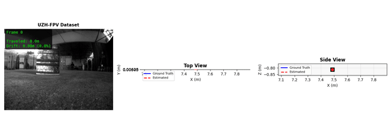
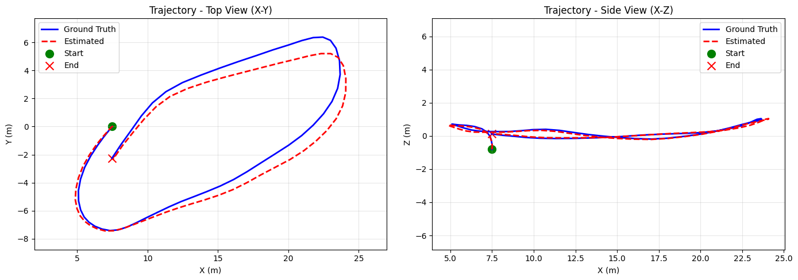
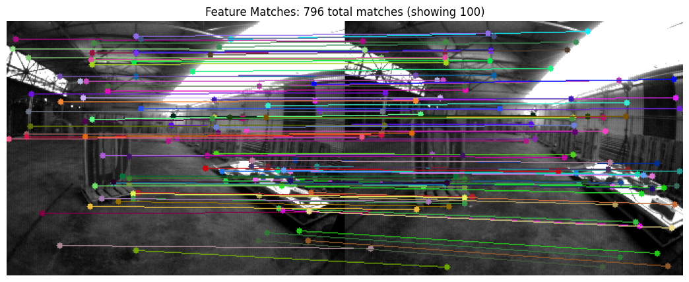
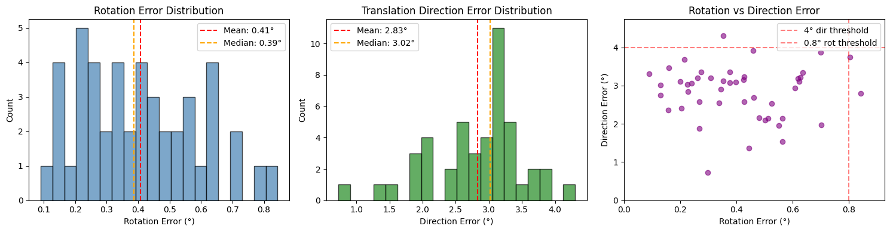

# Monocular Visual Odometry

Estimate relative pose (rotation and translation direction) between two images using only camera intrinsics.



## Performance

On UZH-FPV drone racing dataset (46 frame pairs):

| Metric | Value |
|--------|-------|
| Rotation error | 0.41° mean, 0.84° max |
| Direction error | 2.83° mean, 4.30° max |

| Rotation Threshold | Accuracy |
|-------------------|----------|
| < 0.5° | 67% |
| < 0.8° | 96% |
| < 1.0° | 100% |

| Direction Threshold | Accuracy |
|--------------------|----------|
| < 3.0° | 48% |
| < 3.5° | 89% |
| < 4.5° | 100% |

| Combined | Accuracy |
|----------|----------|
| rot<0.5° AND dir<3.5° | 61% |
| rot<0.8° AND dir<4.0° | 94% |
| rot<1.0° AND dir<4.5° | 100% |

### Trajectory Reconstruction (Image by image)


### Feature Matching (LightGlue + SuperPoint)


### Error Distributions



---

## Demo - Please run to see performance

Run the quickstart in Colab:

[](https://colab.research.google.com/github/galbb12/project_in_advanced_robotics/blob/main/quickstart.ipynb)

**Tip:** Enable GPU for faster inference: Runtime → Change runtime type → GPU

The notebook will:
1. Download test dataset and models automatically
2. Run pose estimation on sample images
3. Show benchmark results and visualizations

---

## Features

- **SuperPoint + LightGlue** for robust feature matching
- **MAGSAC++** Essential matrix estimation
- **Fisheye distortion** correction
- **Auto device detection** (CUDA / MPS / CPU)

## Local Installation

```bash
git clone https://github.com/galbb12/project_in_advanced_robotics.git
cd project_in_advanced_robotics
pip install -r requirements.txt
```

## CLI Usage

```bash
python estimate_pose.py \
    --img1 image1.png \
    --img2 image2.png \
    --fx 500 --fy 500 --cx 320 --cy 240
```

With fisheye distortion:

```bash
python estimate_pose.py \
    --img1 image1.png \
    --img2 image2.png \
    --fx 172.99 --cx 163.34 --cy 135.00 \
    --dist="-0.0276,-0.0066,0.0009,-0.0003" --fisheye
```

## Python API

```python
from estimate_pose import PoseEstimator
import numpy as np

K = np.array([[500, 0, 320],
              [0, 500, 240],
              [0, 0, 1]])

estimator = PoseEstimator(device='auto')
estimator.load_models()

result = estimator.estimate('img1.png', 'img2.png', K)

if result['success']:
    R = result['R']  # 3x3 rotation matrix
    t = result['t']  # Unit translation direction
```

## Output

- **R**: 3x3 rotation matrix (camera 1 to camera 2)
- **t**: Normalized translation direction (scale-free)

Note: Monocular VO cannot determine absolute scale.
